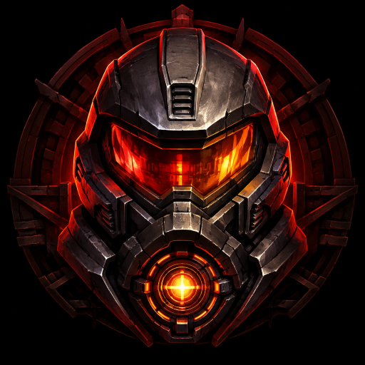

> **Disclaimer:** This is an AI-assisted project developed using OpenAI Codex.

<p align="center"></p>
<h1 align="center">Yamagi Quake II for PS5</h1>
<p align="center"><strong>Quake II, running natively on PlayStation 5 homebrew.</strong><br>1080p OpenGL rendering, DualSense controls, sound and local saves.</p>
<p align="center">
  
  
  
  
  <a href="LICENSE"></a>
</p>

## Highlights

- Based on Yamagi Quake II 8.70, with a native PS5 lifecycle and static GL3 renderer.
- Powered by [PS5 OpenGL](https://github.com/blackbearreloaded/ps5-opengl), consumed from its pinned GitHub SDK release with the game's two performance adaptations.
- Renders at **1920 × 1080**, targeting 60 FPS, with an FPS overlay at the top left.
- DualSense input is sampled independently of rendering, preserving short button presses.
- Stereo sound, controller defaults, writable saves and configuration.
- Custom shell icon, selection/launch backgrounds and looping selection music.
- Includes the renderer patches and host regressions used to resolve startup, input, audio and performance problems.

This app requires an already configured, compatible PS5 homebrew environment.
It contains no exploit, proprietary Sony SDK or firmware modules.
**Current app downloads include the verified Quake II 3.14 demo and are ready
to launch.** Retail game data is separate. Game assets are downloaded during
packaging and remain outside Git; their original license and readme accompany them.

## Install

1. Download `PPSA99007.zip` and verify it against `SHA256SUMS` from the
   [release page](https://github.com/blackbearreloaded/ps5-yamagi-quake2/releases)
   using its accompanying `.sha256` file.
2. Extract the archive. Demo data is already present in `PPSA99007/assets/baseq2/`.
   To use your own retail game, see [game data setup](docs/game-data.md).
3. Copy the complete `PPSA99007` folder into your loader's homebrew directory,
   normally `/data/homebrew/`, producing `/data/homebrew/PPSA99007/eboot.bin`.
4. Refresh or restart the loader, then launch **Yamagi Quake II**. Updated shell
   artwork/music may require a full loader restart to refresh cached presentation assets.

```text
PPSA99007/
├── eboot.bin
├── assets/baseq2/
│   ├── yq2.cfg             supplied controller/audio defaults
│   ├── pak0.pak            verified demo data
│   ├── players/            demo player assets
│   └── DEMO-LICENSE.txt    original demo terms
├── sce_module/libc.prx     clean-room application runtime
└── sce_sys/                metadata, artwork and selection music
```

The ZIP and `PPSA99007.ffpfsc` contain the same complete demo installation.
Install either format supported by your loader. The FFPFSC is unpacked and
compared byte-for-byte during CI, including its required startup assets.
Version `0.1.0-alpha.1` omitted game data and cannot launch by itself; replace
that package with the current demo build.
Save games and user configuration live under `/download0/yamagi/baseq2/`.
Back up that directory before replacing an existing installation.

## Controls

| Input | Action |
| --- | --- |
| Left stick / right stick | Move / look |
| D-pad in menus | Navigate |
| Cross / Circle in menus | Confirm / back |
| Options | Pause / menu |
| R2 | Fire |
| Cross / Circle in game | Jump / crouch |
| L1 / R1 | Previous / next weapon |
| L3 | Speed modifier |
| Triangle / Square | Inventory / use selected item |
| D-pad up / down in game | Previous / next inventory item |
| Touchpad press | Help / objectives |

Defaults are in [yq2.cfg](assets/baseq2/yq2.cfg). Existing user `config.cfg`
and `autoexec.cfg` load afterward and can override them.

## Performance and current limits

The final 1080p candidate achieved **user-reported stable 60 FPS** while moving
and firing in a bounded demo-level test on **one PS5 running firmware 6.02**.
This is an alpha result, not a guarantee for every scene or console. Sampled
timings still include occasional frames around 33 ms. See [performance notes](docs/performance.md).

The release uses a frozen, game-specific OpenGL runtime with buffer allocation
and texture-flush optimizations. It does not inherit a full CTS qualification
from an older runtime. A separate 2160p experiment ran around 30–60 FPS and is
not the release build.

Retail campaigns, expansion packs, multiplayer, long sessions, suspend/resume
and device-loss recovery remain unqualified. Single-mip textures are the fast
default and can shimmer at distance. Selection music passed format validation
and independent decoding; fresh shell playback has not been checked on TV.

## Build

Use Ubuntu 24.04 or WSL with Python 3.12 and Clang 18:

```bash
sudo apt update
sudo apt install build-essential clang clang-18 lld-18 llvm-18 make python3 python3-venv git gh \
  pkg-config wget unzip libssl-dev libsdl2-dev libegl1-mesa-dev \
  libgl1-mesa-dri glslang-tools

gh auth login                    # account with access while this repo is private
make deps
make package
# Optional: also create the compressed image
make ffpfsc
```

Outputs: `dist/PPSA99007/`, `dist/PPSA99007.zip` and its checksum file.
`make ffpfsc` additionally creates `dist/PPSA99007.ffpfsc` and its checksum,
using pinned MkPFS with content verification enabled.
Packaging downloads the official demo from Yamagi's mirror, checks its pinned
SHA-256, and includes unchanged game assets and original notices. It also restores pinned
Yamagi and native-app sources, the public homebrew toolchain, PacBrew SDL2 and
the [PS5 OpenGL GitHub SDK](https://github.com/blackbearreloaded/ps5-opengl/releases/tag/v0.1.0-perf20260907-sampled),
plus a small hash-pinned game runtime overlay. Graphics binaries are release dependencies, not Git blobs.
See [dependencies and source reproduction](docs/building.md).

For host checks only:

```bash
python3 tools/bootstrap.py --host-only
make test
```

The [Build workflow](.github/workflows/build.yml) runs host regressions on pushes
and pull requests. Manual dispatch builds and uploads the native ZIP, FFPFSC
and their checksums using the frozen SDK release asset. Set the optional
`release_tag` input to an existing release to publish both packages and checksums;
leave it blank for CI artifacts only. Existing release files are not overwritten.
Console testing is manual and separate.

## Project layout

```text
src/ps5/          Native entry, EGL/video, input, lifecycle and compatibility code
patches/          Yamagi renderer/platform changes and OpenGL texture-cache delta
assets/baseq2/    Controller, audio and FPS defaults; no game data
sce_sys/          PS5 metadata, converted artwork and selection music
tooling/native/  Heap/runtime helpers, link stubs and linker configuration
tools/           Dependency restoration, build, demo preparation and packaging
tests/           Host regressions, shader checks and game-data validation
docs/            Installation, build, performance and artwork sources
upstream/        Pinned Yamagi checkout restored here; ignored by Git
.deps/           Downloaded build dependencies; ignored by Git
```

## Credits and license

Thanks to **id Software**, the **Yamagi Quake II** contributors,
**ps5-payload-dev**, **PacBrew**, **SDL**, **Mesa**, **OpenGNM**, and contributors
to [PS5 OpenGL](https://github.com/blackbearreloaded/ps5-opengl) and the
[native-app boilerplate](https://github.com/blackbearreloaded/ps5-native-app-boilerplate).
The repository organization follows [ProsperoAI](https://github.com/blackbearreloaded/ProsperoAI).

Project code is GPL-3.0-or-later; upstream components retain their own licenses.
See [LICENSE](LICENSE) and [third-party notices](THIRD_PARTY_NOTICES.md).
Quake II game data and trademarks belong to their respective owners. This is
an unofficial port and is not affiliated with id Software, Bethesda or Sony.
